# Phase 0.5 — Physics & Visual Validation 결과

2026-09-17 · `apps/physics-prototype` · Rapier 0.20 (WASM) · Three.js 0.186
환경: 샌드박스 컨테이너 (Node 22, 단일 스레드). 브라우저는 headless Chromium + SwiftShader(소프트웨어 GPU): **스크린샷과 동작 검증용이며 FPS 는 성능 평가에 쓰지 않는다** (§8).

## 1. 한 줄 결론

- **Natural 프리셋 확정.** 10k 기준 기울기 중앙값 2.3°(p95 5.4°), 층 간격 중앙값 1.01 두께, 수평 퍼짐 최대 9 cm, 심각한 침투 없음(최대 0.18 두께). 육안으로 복제된 원반 기둥이 아니라 팬케이크 더미로 보인다.
- **100k 안정적 stacking**: 바닥 관통 0, 비정상 값 0, 침투 p95 0.11 두께(최대 0.24), 높이 1,013 m (효율 101%).
- **10분 Drop cutoff 60초 확정**: 100k Drop 계산 wall time p50 44.2 s / p95 44.4 s, 5회 실패 0, 최대 RSS 219 MB. 단 여유가 16초뿐이며 단일 스레드 기준이다 (§6 의 연속 시뮬레이션 전략 참고).
- **서버 Transform ↔ 클라이언트 연출 분리 확인**: 클라이언트 낙하 연출 종료 시 렌더 인스턴스가 서버 값에 오차 0 으로 수렴 (§7).
- 검증 중 발견한 버그 2건 수정: 쿼터니언 up 벡터 부호 오류(드레이프가 받침 기울기를 거울상으로 계승), 드레이프 스냅이 y 만 맞춰 가장자리가 받침에 파고들던 문제.

## 2. 측정 정의 (§2)

| 항목 | 정의 |
| --- | --- |
| Height | 정착한 팬케이크 최고점 (m). Ideal = 개수 × 두께. Efficiency = Height / Ideal |
| Spread | 탑 축(원점)에서 각 팬케이크 중심까지의 수평 거리 (m). median / p90 / p95 / max |
| Tilt | 팬케이크 법선과 수직축 사이 각 (deg). median / p90 / p95 / max |
| Layer spacing | y 로 정렬한 중심 간 간격 / 두께. median / p05 / p95 |
| Penetration | 이웃 쌍의 평균 법선 방향 겹침 / 두께. 5% 초과 쌍 수, max, p95. 기울기가 다른 두 강체 원반은 가장자리에서 소량 겹치는 것이 정상이므로 "심각" 기준은 50% |
| belowGround | 바닥(y=0) 아래로 5% 두께 이상 내려간 팬케이크 수 |

구현: `src/sim/metrics.ts`, 테스트 `metrics.test.ts`. 덤프 파일에서 재계산: `tsx bench/metrics.ts public/towers/*.bin`.

## 3. Stacking 품질 — Natural, 크기별 (§2, §9)

seed 20260917, 동일 설정.

| 팬케이크 | 높이 | Ideal | 효율 | 퍼짐 med / p90 / p95 / max (m) | 기울기 med / p90 / p95 / max (°) | 층 간격 med / p05 / p95 | 침투 쌍 / 검사 | 침투 max / p95 | 바닥 관통 |
| ---: | ---: | ---: | ---: | --- | --- | --- | --- | --- | ---: |
| 100 | 1.01 m | 1.00 m | 100.7% | 0.016 / 0.027 / 0.031 / 0.034 | 2.00 / 4.53 / 6.37 / 7.82 | 0.998 / 0.928 / 1.075 | 2 / 557 | 0.072 / 0.053 | 0 |
| 1,000 | 10.13 m | 10.00 m | 101.3% | 0.021 / 0.037 / 0.040 / 0.065 | 2.25 / 4.42 / 5.20 / 9.42 | 1.009 / 0.923 / 1.114 | 29 / 5,636 | 0.111 / 0.088 | 0 |
| 10,000 | 101.45 m | 100.00 m | 101.5% | 0.026 / 0.048 / 0.055 / 0.094 | 2.32 / 4.45 / 5.39 / 11.91 | 1.010 / 0.927 / 1.115 | 333 / 56,441 | 0.184 / 0.107 | 0 |
| 100,000 | 1,013.5 m | 1,000.0 m | 101.3% | 0.027 / 0.049 / 0.055 / 0.094 | 2.25 / 4.36 / 5.26 / 12.28 | 1.007 / 0.928 / 1.116 | 3,440 / 565,669 | 0.240 / 0.107 | 0 |

- 퍼짐은 1k → 100k 에서 거의 늘지 않는다 (max 6.5 → 9.4 cm). `spawnRecenter 0.1` 이 top-follow 스폰의 random walk 를 유계로 만든다. **장기적으로 넓게 퍼지지 않음** 조건 충족.
- 효율 101% 는 기울어진 팬케이크가 만드는 쐐기형 공기층 때문이다. 목표는 100% 가 아니므로 문제 삼지 않는다.
- 침투 쌍은 전체 이웃 쌍의 0.6%, 모두 두께의 25% 이하. **심각한 상호 침투 없음** 충족.

시뮬레이션 비용 (변화 없음): 0.43~0.53 ms/step, 100k 43 s, 최대 SURFACE 콜라이더 11, RSS 232 MB.

## 4. Drape 프리셋 비교 — 10k, seed 20260917 (§4)

| 프리셋 | drape | settleTiltJitter | spawnSpread | spawnTilt | recenter | 크기/두께 편차 |
| --- | ---: | ---: | ---: | ---: | ---: | --- |
| Stable | 0.9 | 0.02 | 0.10 | 0.05 | 0.3 | ±3% / ±5% |
| **Natural** | 0.6 | 0.06 | 0.20 | 0.15 | 0.1 | ±5% / ±10% |
| Loose | 0.35 | 0.12 | 0.35 | 0.30 | 0.05 | ±6% / ±12% |

| 프리셋 | 효율 | 퍼짐 med / p95 / max (m) | 기울기 med / p95 / max (°) | 층 간격 med / p05 / p95 | 침투 쌍 | 침투 max / p95 | 시뮬 시간 |
| --- | ---: | --- | --- | --- | ---: | --- | ---: |
| Stable | 100.0% | 0.008 / 0.016 / 0.025 | 0.59 / 1.14 / 2.01 | 1.000 / 0.964 / 1.035 | 0 | 0 / 0 | 3.9 s |
| **Natural** | 101.5% | 0.026 / 0.055 / 0.094 | 2.32 / 5.39 / 11.91 | 1.010 / 0.927 / 1.115 | 333 | 0.184 / 0.107 | 4.9 s |
| Loose | 108.4% | 0.088 / 0.174 / 0.255 | 6.07 / 13.61 / 25.41 | 1.036 / 0.907 / 1.506 | 1,563 | 0.771 / 0.316 | 7.0 s |

스크린샷 (측면 = 중간 구간, 상단 = 최상단 바로 위, 45도 = 최상단):

| | 측면 | 상단 | 45도 |
| --- | --- | --- | --- |
| Stable | 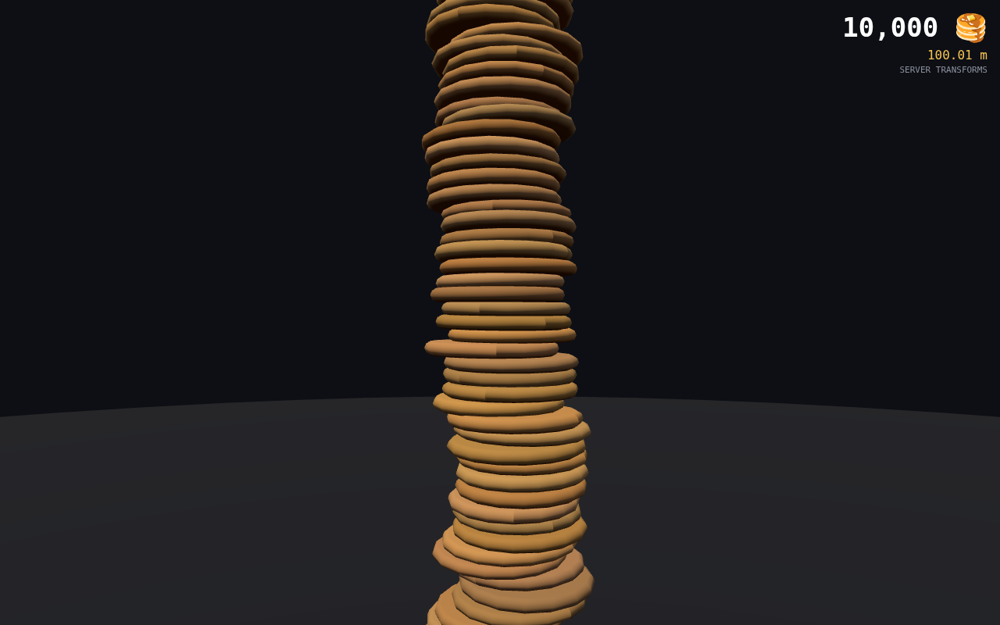 | 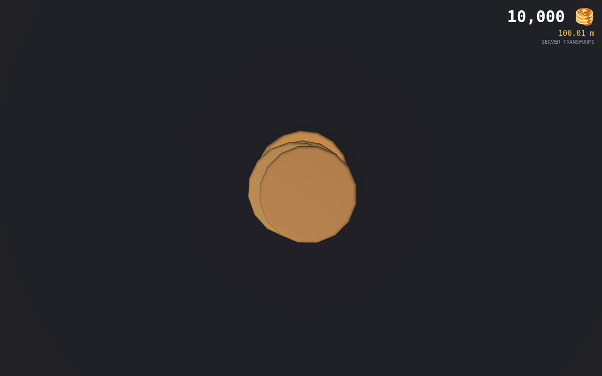 | 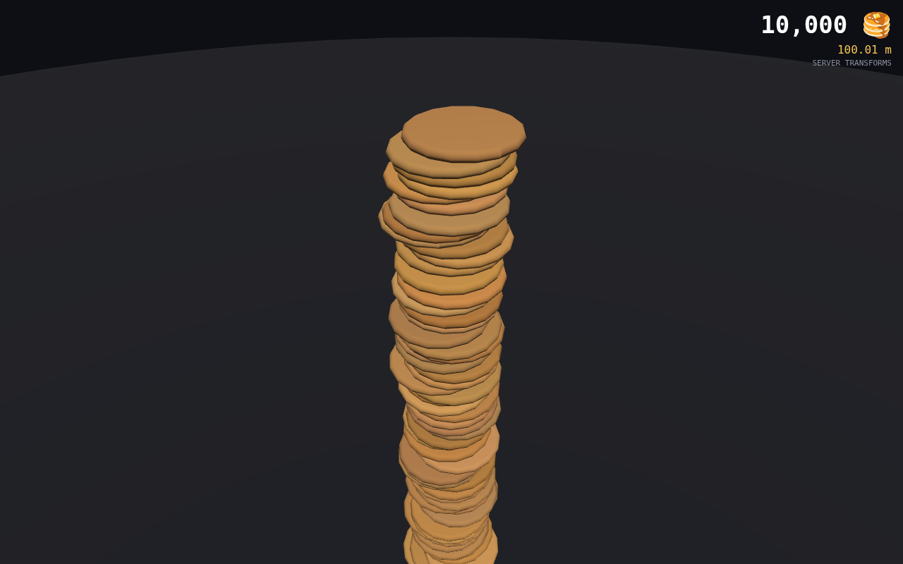 |
| Natural | 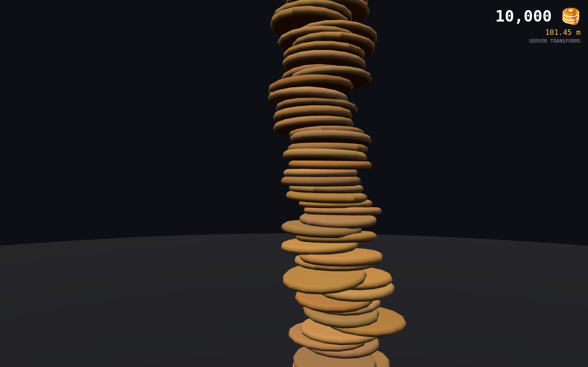 | 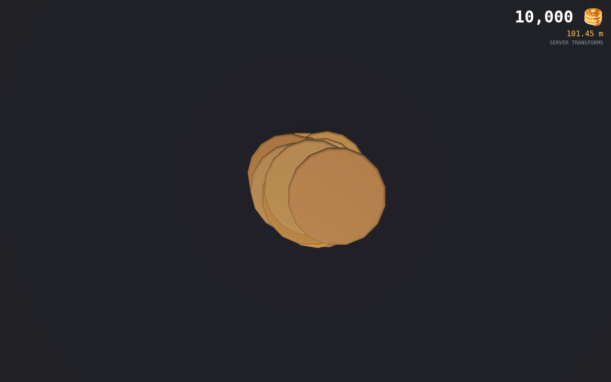 | 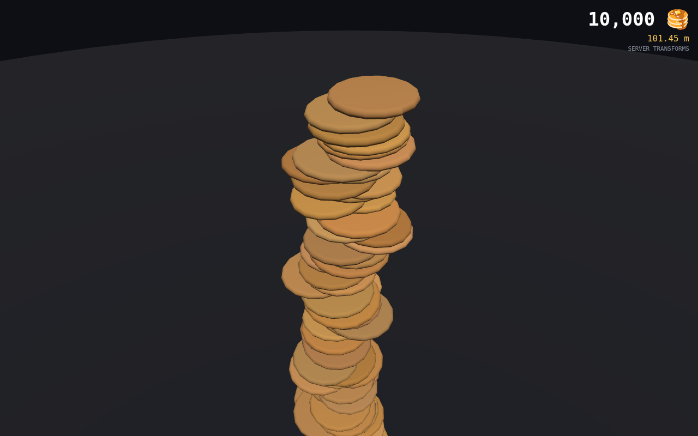 |
| Loose | 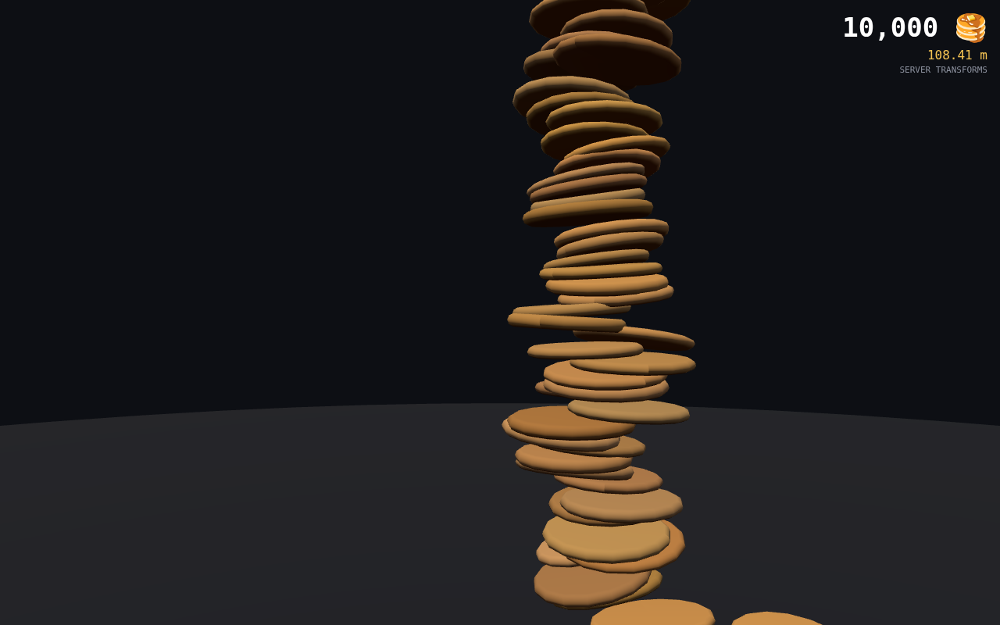 | 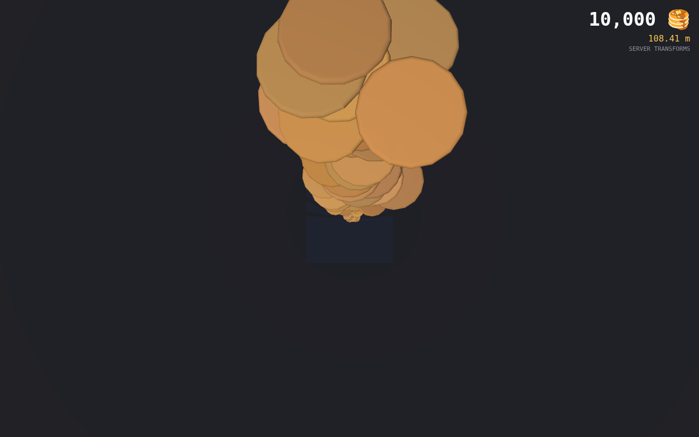 | 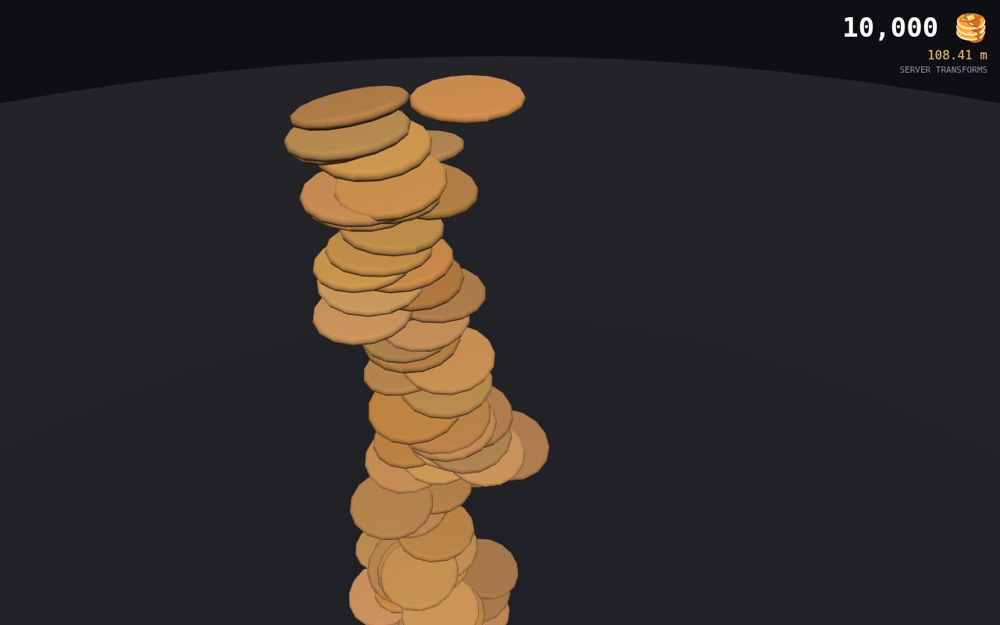 |

판단:

- **Stable**: 수치는 가장 좋지만 동전을 쌓은 기둥처럼 보인다. 팬케이크마다의 차이가 거의 없다. 탈락.
- **Natural**: 층마다 회전·기울기·크기 차이가 보이고, 몇 장 단위로 살짝 기우는 구간이 생겨 "하나씩 쌓인" 느낌이 있다. 침투는 가장자리 소량뿐. **채택.**
- **Loose**: 위로 갈수록 흐트러지고, 가장자리에 걸려 떠 보이는 팬케이크가 생긴다(시럽 규칙의 캔틸레버). 침투 최대 0.77 두께. 탈락.

## 5. Pancake variation (§5)

일반 팬케이크에 다음 편차를 넣었다. 물리에는 콜라이더 크기로만 반영되며 정착 결과에 큰 영향이 없다 (Stable 프리셋에서 편차를 켜도 효율 100.0%).

| 항목 | Natural 값 | 구현 |
| --- | --- | --- |
| 직경 | ±5% | `sizeJitter` → `scale[id]`, 콜라이더 반지름 |
| 두께 | ±10% | `thicknessJitter` → `tscale[id]`, 콜라이더 반높이, 렌더 비균등 스케일 |
| 스폰 yaw | 0~360° | 스폰 시 무작위, 정착 시 유지 |
| 정착 기울기 | ±0.06 rad 추가 | `settleTiltJitter` (드레이프 결과에 소량 더함) |
| 색 | 색상 ±0.01, 채도 ±0.08, 명도 ±0.09 | 인스턴스 색 (id 해시) |

Rare Pancake 는 구현하지 않았다.

## 6. Drop scheduling (§6)

`bench/schedule.ts`, 100k × 5회, Natural, seed 1000~1004, 단일 스레드.

| 항목 | 값 |
| --- | --- |
| wall time p50 | 44.2 s |
| wall time p95 | 44.4 s |
| min / max | 43.8 s / 44.7 s |
| 실패 (오류·leak·60 s 초과) | 0 / 5 |
| 최대 RSS | 219 MB |
| step 수 | 약 91,650 (0.48 ms/step) |

**Cutoff 60초 확정.** p95 44 s < 60 s. 다만:

- 여유는 16초이고 이 CPU 는 단일 스레드다. 계산 시간은 step 수에 비례하고 step 수는 스폰 속도(step 당 2장)로 정해진다. 스폰 속도를 4장으로 올리면 39 s 로 10% 만 빨라지고(활성 강체가 늘어 step 비용 증가) 침투 max 가 0.41 로 나빠져 채택하지 않는다.
- **권장 전략: 연속 시뮬레이션.** Drop 큐는 구매 순서가 고정이므로 cutoff 를 기다릴 필요 없이 구매가 들어오는 대로 Physics Worker 가 쌓아 둔다. cutoff(T−60 s) 시점에는 마지막 1분 치 구매만 남아 있어 100k 전체가 아니라 그 꼬리만 계산한다. 10만 장이 한꺼번에 마지막 1분에 들어오는 극단 상황에서만 44 s 가 걸린다.
- 100k 를 넘는 Drop 이 상시화되면 cutoff 를 늘리는 대신 simulation architecture 를 다시 검토한다 (스펙 §6 원칙). 후보: 탑 상단 상태를 공유하는 여러 Worker 의 순차 파이프라인, 또는 Wave 분할.

```text
구매 → (즉시) Physics Worker 가 순서대로 쌓음 → T-60 s Drop Queue close
    → 남은 꼬리 계산 (≤ 44 s 최악) → T = 00 Visual Drop 시작
cutoff 이후 구매 → 다음 Drop 큐
```

## 7. 서버 물리 / 클라이언트 연출 분리 (§7)

- 서버 결과 파일 `PKT1` (`src/sim/towerFile.ts`): id(index), position, quaternion, scale, tscale. 클라이언트는 이것만 읽는다 (`?load=towers/100000-natural.bin`).
- 렌더러 인터페이스 `InstanceSource` 는 서버 값 배열만 받는다. 카메라·낙하 연출·색·타이밍은 클라이언트에 있다.
- Drop Replay 검증: 로드된 100k 탑의 마지막 2,000 장을 클라이언트가 30 units 위에서 순차 낙하시킨 뒤(ease-out, 회전 흔들림 포함) 종료 시 서버 값으로 되돌리고, 렌더 인스턴스 행렬을 서버 값과 비교한다.

결과 (`phase0.5-scenes.json` → `loaded100k.replay`):

| 항목 | 값 |
| --- | --- |
| 연출한 팬케이크 | 2,000 |
| 연출 시간 | 4,000 ms |
| 종료 후 위치 오차 max | 0 |
| 종료 후 회전 오차 max | 1.9e−7 (float32 저장 정밀도) |
| 수렴 | ✅ |

클라이언트 연출은 렌더 인스턴스 행렬만 바꾸고, 종료 시 서버 배열 값을 다시 써서 동기화한다. 서버 값은 연출 중에도 바뀌지 않는다(`goal` 배열은 읽기 전용 복사본).

## 8. 실제 기기 Benchmark (§8)

이 환경에서는 실제 기기 측정을 할 수 없다. 절차와 도구만 준비했다.

- URL: `?synthetic=100000&auto=1&quality=standard` → `500000` → `1000000`. (`synthetic` 은 물리 없이 절차적으로 쌓은 탑. 물리 결과 파일이 있으면 `load=` 로 대체 가능.)
- 수집값 (EXPORT JSON / `window.__RESULT`): average FPS, p95 frame time, draw calls, JS heap(Chrome), instance count, load time, GPU renderer name(가능한 경우), browser UA, screen/viewport, quality preset.
- 기기 보호: 프레임이 5회 연속 3초를 넘거나 JS heap 이 한계의 85% 를 넘으면 자동 중단하고 마지막 정상 결과에 `aborted: true` 를 붙여 기록한다.

headless SwiftShader 참고값 (성능 평가 아님):

| 합성 탑 | FPS | frame p95 | draw calls (chunk) | heap | load | 중단 |
| ---: | ---: | ---: | ---: | ---: | ---: | --- |
| 500,000 | 0.08 | 413 ms | 51 | 10 MB | 1.0 s | 없음 |
| 1,000,000 | 1.6 | 205 ms | 100 | 10 MB | 1.4 s | 없음 |

두 값 모두 소프트웨어 래스터라이저 결과이며(1M 이 500k 보다 빠르게 나온 것은 전체 뷰에서 탑이 1픽셀 미만이라 래스터 부하가 거의 없고 노이즈가 지배하기 때문), 성능 평가에 쓰지 않는다. 확인된 것은 절차뿐이다: 1M 인스턴스가 100 chunk 로 생성·동기화·렌더되고, 기기 보호 로직이 오작동(불필요한 중단)하지 않았다. Chrome 의 `performance.memory` 는 헤드리스에서 typed array 를 heap 에 잡지 않아 10 MB 로 보인다. 실제 기기에서는 1M × 16 float 행렬 = 64 MB 이상이 잡힌다.

## 9. 100k 객체 검증 (§9)

100k 서버 결과 파일을 로드해 네 장면을 확인했다 (SwiftShader, Performance 품질).

| 전체 | 중간 확대 | 최상단 | Find Pancake #54,321 |
| --- | --- | --- | --- |
| 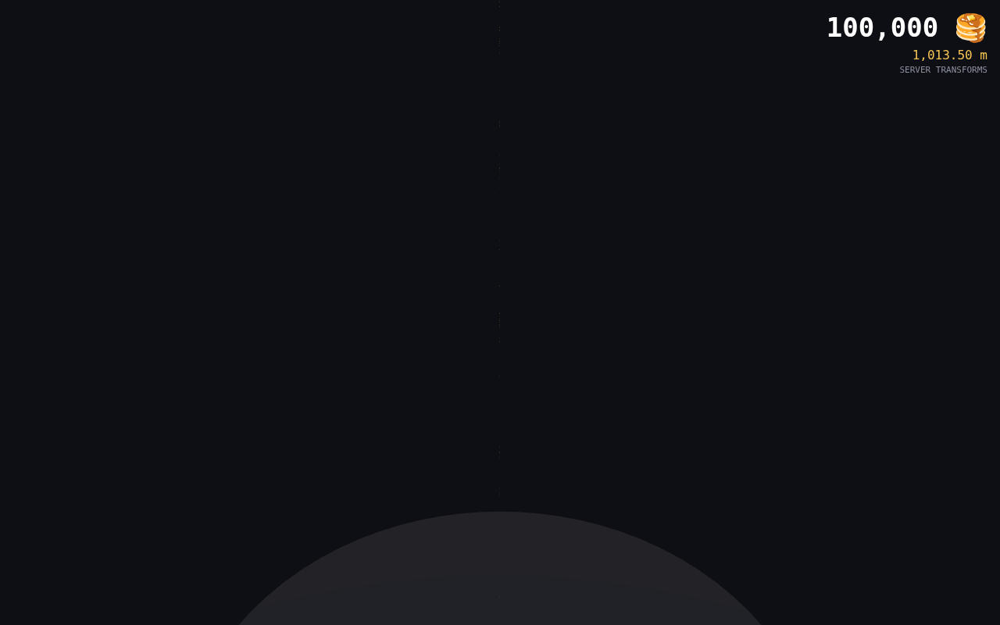 | 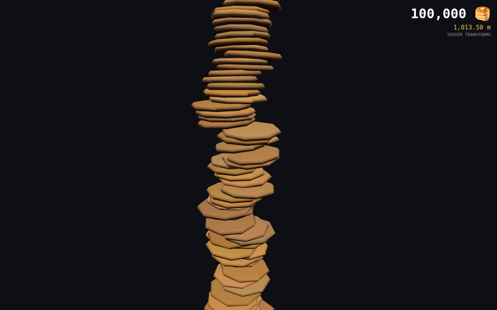 | 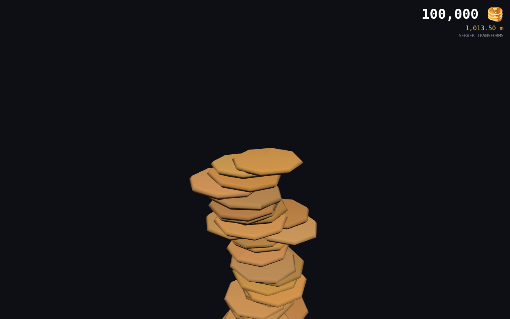 | 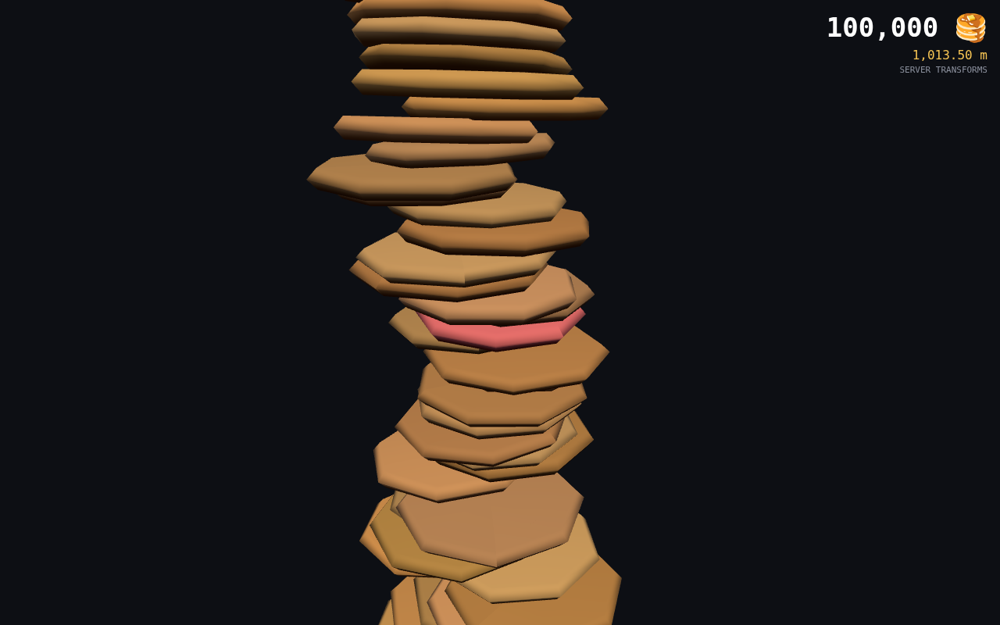 |

Find Pancake 는 `id → chunk = floor(id / 10,000) → instance = id mod 10,000` 으로 해당 InstancedMesh 의 행렬을 직접 읽는다 (`TowerRenderer.locate`). 전체 탐색 없음. 찾은 팬케이크는 빨간색으로 강조하고 카메라가 이동한다.

100k 로드 모드 측정값 (SwiftShader, Performance): instances 100,000, draw calls 10 (chunk 10개), 로드+동기화 후 정상 렌더. 전체 뷰는 높이 10 km · 폭 10 cm 탑이라 화면에서 1픽셀 미만의 선으로만 보인다. 플랜 §11 이 예상한 대로이며, 원거리 뷰에는 Phase 2 의 LOD 와 별도의 실루엣 보조가 필요하다는 근거다.

## 10. 최종 선택 파라미터

`DEFAULT_CONFIG` = Natural (`src/sim/types.ts`).

| 파라미터 | 값 | 비고 |
| --- | --- | --- |
| diameter / thickness | 1.0 / 0.1 unit (10 cm / 1 cm) | edgeRadius 0.03 |
| sizeJitter / thicknessJitter | 0.05 / 0.10 | |
| gravity / linearDamping / angularDamping | −98.1 / 2.0 / 2.0 | 종단속도 ≈ 4.9 m/s |
| friction / restitution | 0.9 / 0 | |
| batchSize / spawnPerStep | 500 / 2 | |
| spawnMode / spawnSpread / spawnTilt / spawnRecenter | top / 0.20 / 0.15 rad / 0.1 | |
| stickOnContact / stickMaxPenetration | on / 0.05 | 시럽 규칙 |
| drape / settleTiltJitter | 0.6 / 0.06 rad | 드레이프 규칙 (평균 법선 스냅) |
| freezeDepth | 0.6 unit | 묻힘 판정 |
| contactHz / solverIterations / ccd / dt | 30 / 4 / on / 1/60 | |

## 11. 완료 조건 점검 (§10)

| 조건 | 상태 |
| --- | --- |
| 바닥 관통 없음 | ✅ 100 ~ 100k 모두 0 |
| 심각한 Pancake penetration 없음 | ✅ 100k max 0.24 두께, p95 0.11 |
| 100k 안정적 stacking | ✅ 5회 반복 실패 0 |
| Natural preset 확정 | ✅ |
| Chunk Instancing 정상 | ✅ 100k = 10 chunk, draw call 11 (10 + 바닥) |
| Find Pancake 정상 | ✅ index 기반, 스크린샷 |
| 실제 기기 최소 1대에서 100k 확인 | ❌ **미완.** 이 환경에서 불가. 절차·도구만 준비 (§8) |
| 100k Drop 계산시간 p95 측정 | ✅ 44.4 s |
| 10분 Drop cutoff 전략 확정 | ✅ 60 s + 연속 시뮬레이션 |
| 문서 | ✅ 이 문서 |

## 12. 미해결 리스크

1. **실제 기기 미측정.** SwiftShader 수치는 무의미하다. Phase 1 진입 전 Desktop / iPhone / Android 각 1대에서 §8 절차를 실행해야 한다.
2. **Cutoff 여유 16초 (단일 스레드).** 연속 시뮬레이션 전략을 Phase 3 에서 구현해야 실질적 여유가 생긴다. 서버 CPU 가 이 샌드박스보다 느리면 60초를 넘을 수 있다.
3. **Rapier 0.20 CCD 패닉.** Release(붕괴) 경로에서 시드에 따라 `unreachable` 패닉이 난다. 정상 Drop 경로(100k × 5회 + 각 크기)에서는 재현되지 않아 스펙대로 조사하지 않았다. Phase 3b 에서 Rapier 버전 업 또는 CCD 대체를 검토.
4. **강체 원반의 가장자리 겹침.** 기울기 차이가 있는 두 팬케이크는 가장자리에서 두께의 최대 25% 까지 겹친다(실제 팬케이크는 휘어서 흡수). 근접 카메라에서 보일 수 있다. 시각 디자인 단계에서 팬케이크 모델의 가장자리 두께로 가릴 수 있는지 확인.
5. **시럽 규칙의 캔틸레버.** 가장자리에 걸린 팬케이크가 떠 있는 것처럼 보일 수 있다. Natural 에서는 드물지만 Loose 에서 두드러진다. 최대 오버행 제한 규칙(중심이 받침 밖이면 미끄러지게) 은 Phase 1 이후 검토.
6. **효율 > 100%.** 공기층 때문에 실제 높이가 개수 × 두께보다 1~2% 크다. 높이 표시(플랜 §13)는 실측값이므로 문제는 아니지만, "한 장 = 1 cm" 홍보 문구와는 어긋난다.

원본 데이터: `phase0.5-preset-{stable,natural,loose}.json`, `phase0.5-sizes-natural.json`, `phase0.5-100k-spawn4.json`, `phase0.5-schedule-100k.json`, `phase0.5-scenes.json`, PNG 파일들.
