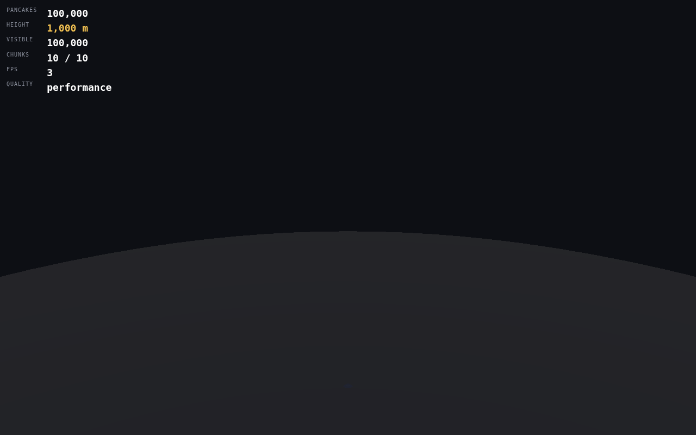
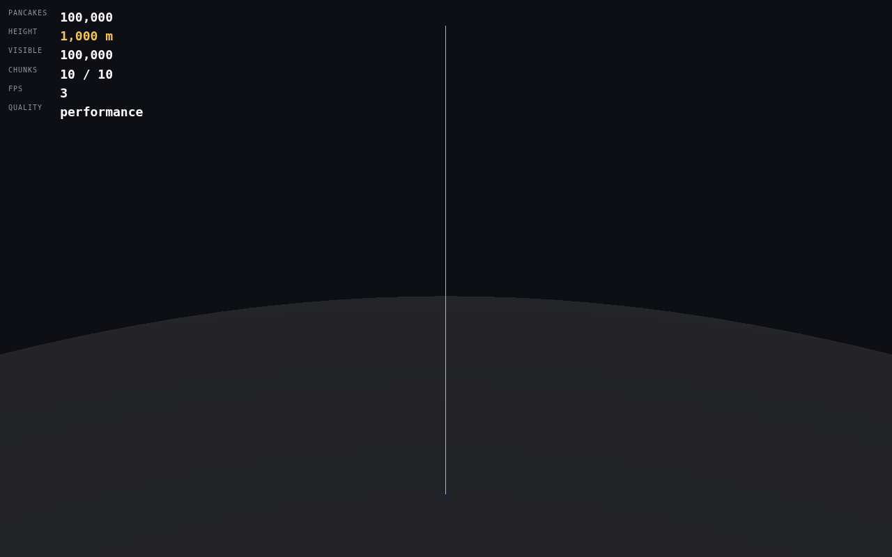
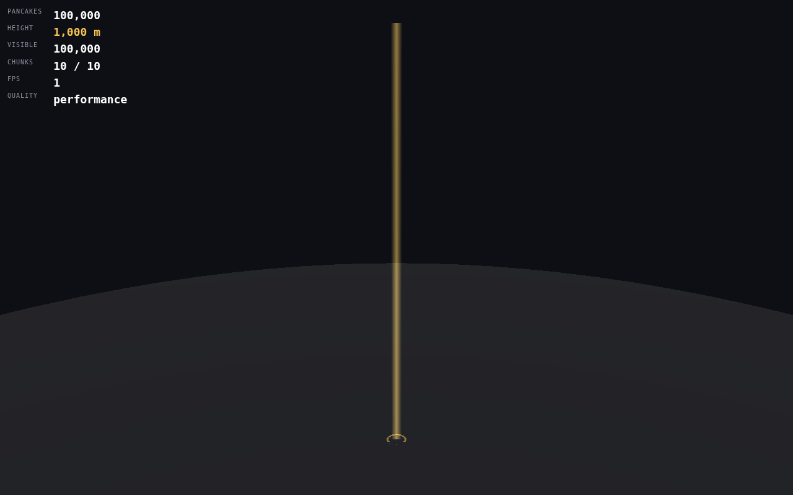
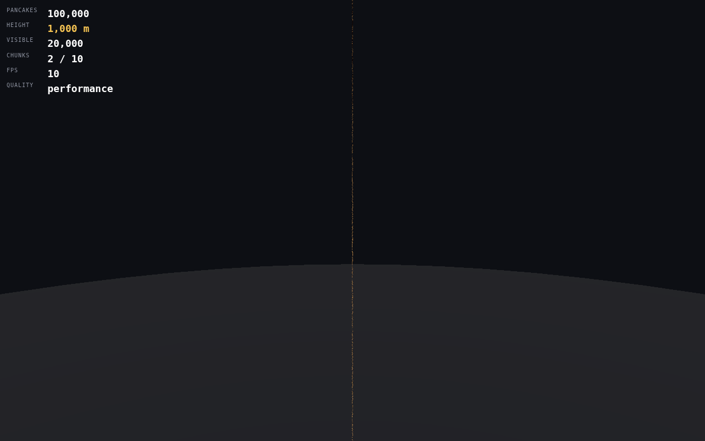
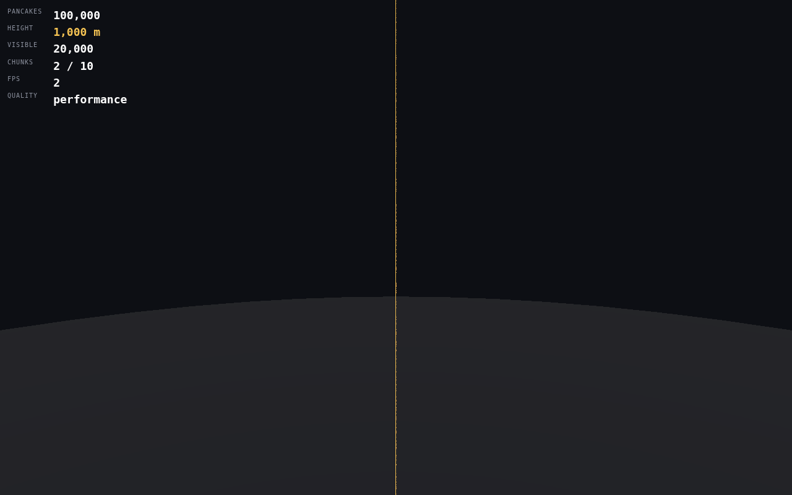
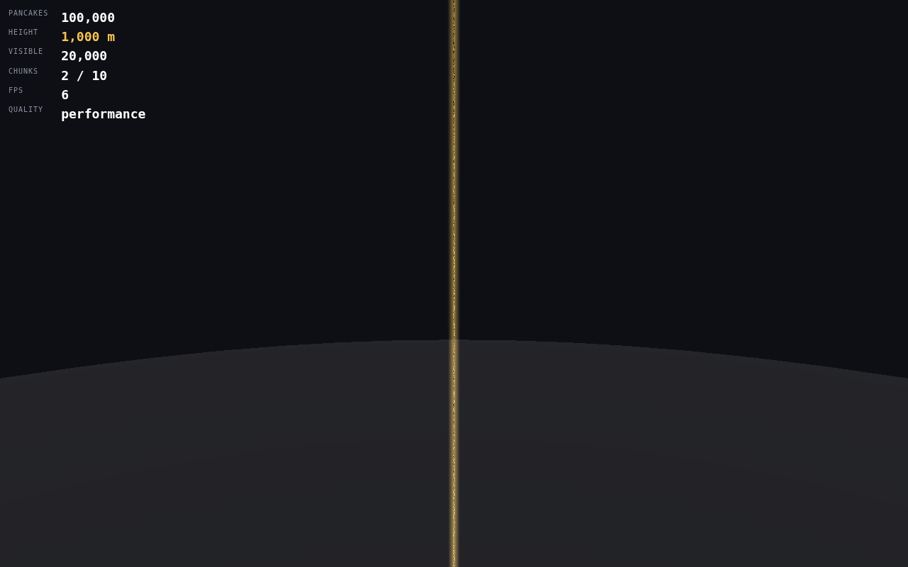

# Phase 1 — World Engine 벤치마크

2026-09-18 · 컨테이너(Node 22 단일 스레드, headless Chromium + SwiftShader). 브라우저 FPS 는 성능 평가에 쓰지 않는다(소프트웨어 GPU). 구조·정확성·메모리 계산·물리 시간만 의미 있다.

## 1. 한 줄 요약

- **물리 회귀**: Natural 100k 을 다시 쌓은 결과가 Phase 0.5 와 0.1% 안쪽 (높이 1013.50 → 1013.51 m). 버그 수정(§5) 외 물리 변경 없음.
- **연속 시뮬레이션**: 100k 위 +25,000 장 6.3 s (0.25 ms/장), 최대 RSS 321 MB, 침투 max 0.24 두께로 base 와 동일.
- **증분 vs 일괄**: 100장×100회 와 10k 일괄의 높이·기울기·퍼짐·층 간격·침투가 같은 범위. 연속 구조가 이상한 탑을 만들지 않는다.
- **구조**: 100k / 500k / 1M 합성 탑이 10 / 50 / 100 chunk 로 생성·인덱스·렌더된다. Find #54321 → chunk 5 / instance 4321. Replay 5,000 장 서버 값 수렴(오차 0).
- **원거리**: Pure / Silhouette / Atmospheric 스크린샷 비교 준비(PO 선택).

## 2. 물리 회귀 — Natural 100k (스펙 §34)

`phase1-regression-natural-100k.json`, 같은 seed(20260917), 같은 preset. 계산 40.6 s (Phase 0.5: 43.1 s).

| 지표 | Phase 0.5 | Phase 1 | 차이 |
| --- | ---: | ---: | ---: |
| 높이 (m) | 1,013.498 | 1,013.506 | +0.0007% |
| 기울기 median (°) | 2.2498 | 2.2432 | −0.3% |
| 기울기 p95 (°) | 5.2644 | 5.2444 | −0.4% |
| 퍼짐 max (m) | 0.0935 | 0.1022 | +9% (단일 최댓값) |
| 층 간격 median | 1.00708 | 1.00723 | +0.02% |
| 침투 max (두께) | 0.2400 | 0.2328 | −3% |
| 침투 p95 | 0.1072 | 0.1079 | +0.6% |
| 침투 쌍 | 3,440 | 3,393 | −1.4% |

차이의 원인은 §5 의 두 버그 수정(월드 재생성 방식으로 바뀐 솔버 내부 순서, 바닥 매몰 팬케이크 정착)이다. 규칙(시럽·드레이프·Frozen·preset)은 그대로다. 허용 범위: 높이 ±0.5%, 기울기·침투 ±5%, 최댓값 통계는 참고. 모두 안쪽.

## 3. 연속 시뮬레이션 — 100k 위 새 Drop (스펙 §23)

`phase1-continuous-on-100k.json`. base 100k(Phase 0.5 Natural), top-64 surface, 구매 100장씩 즉시 큐 → `processPending(50 ms)` 반복 → close → finalize.

| 추가 | base 로드 | 시뮬레이션 | ms/장 | 최대 RSS | surface 콜라이더 | 높이 후 | 침투 max / p95 |
| ---: | ---: | ---: | ---: | ---: | ---: | ---: | --- |
| +100 | 116 ms | 0.13 s | 1.29 | 165 MB | 64 | 1,014.5 m | 0.240 / 0.107 |
| +1,000 | 86 ms | 0.34 s | 0.34 | 314 MB | 64 | 1,023.6 m | 0.240 / 0.107 |
| +5,000 | 90 ms | 1.39 s | 0.28 | 283 MB | 64 | 1,064.1 m | 0.240 / 0.106 |
| +10,000 | 76 ms | 2.58 s | 0.26 | 308 MB | 64 | 1,114.5 m | 0.240 / 0.106 |
| +25,000 | 76 ms | 6.31 s | 0.25 | 321 MB | 64 | 1,266.1 m | 0.240 / 0.105 |

침투 max 0.240 은 base 100k 안의 기존 값이며 새 Drop 이 늘리지 않는다. 100장 이하는 base 로드(≈80~120 ms)가 지배한다 → 서버는 Drop 마다 base 를 다시 로드하지 않고 시뮬레이터를 유지해야 한다 (ContinuousDropSimulator 가 그렇게 설계됨).

## 4. 증분 vs 일괄 — 10k (스펙 §24)

`phase1-incremental-vs-batch.json`. 같은 seed 4242, base 100k. 마지막 10k 만 계측.

| | 일괄 10,000 | 증분 100장 × 100회 |
| --- | ---: | ---: |
| 시간 | 4.10 s | 2.68 s |
| 높이 후 | 1,114.83 m | 1,114.42 m |
| 퍼짐 median / p95 / max (m) | 0.027 / 0.055 / 0.093 | 0.031 / 0.061 / 0.089 |
| 기울기 median / p95 / max (°) | 2.23 / 5.12 / 11.63 | 2.15 / 4.61 / 10.34 |
| 층 간격 median / p05 / p95 | 1.006 / 0.928 / 1.113 | 1.006 / 0.928 / 1.104 |
| 침투 쌍 / max / p95 | 349 / 0.157 / 0.106 | 280 / 0.159 / 0.097 |

결과가 완전히 같을 필요는 없고(스폰 타이밍이 다름) 분포가 같은 범위다. 증분이 더 빠른 이유는 Drop 마다 finalize 로 정착을 기다려 활성 강체가 적게 유지되기 때문이다.

## 5. 물리 버그 2건 (스펙 §0 예외 조항)

상세는 [`../phase1/CONTINUOUS_DROP.md`](../phase1/CONTINUOUS_DROP.md).

1. **Rapier 0.20 패닉**: 배치 10~22장 패턴에서 FROZEN body 제거(`removeRigidBody`)가 wasm `unreachable`. 개별 제거 대신 활성 강체 0 인 배치 경계에서 월드 재생성(`freezeMode: rebuild`). 회귀 테스트: 시드 6개 × 30/20 패턴.
2. **바닥 매몰 팬케이크**: 떨어져 바닥에 반쯤 묻힌 채 잠든 팬케이크가 영원히 ACTIVE. 바닥 위로 스냅해 정착. 회귀 테스트: continuous 테스트가 finalize 완료를 검증.

## 6. 100k / 500k / 1M 구조 (스펙 §29)

`phase1/phase1-world-structural.json`. 합성 탑(물리 없음), Performance 품질, 상단 뷰.

| 합성 탑 | chunk | 로드 chunk | GPU chunk | 렌더 인스턴스 | LOD0 / LOD1 / LOD2 | draw call | GPU 인스턴스 메모리(추정) | 탑 높이 | 생성+chunk 시간 |
| ---: | ---: | ---: | ---: | ---: | --- | ---: | ---: | ---: | ---: |
| 100,000 | 10 | 1 | 1 | 10,000 | 193 / 1,217 / 8,590 | 4 | 2.2 MB | 999.6 m | 0.6 s |
| 500,000 | 50 | 48 | 47 | 470,000 | 422 / 2,442 / 467,136 | 51 | 102 MB | 4,999.6 m | 0.7 s |
| 1,000,000 | 100 | 1 | 1 | 10,000 | 190 / 1,222 / 8,588 | 3 | 2.2 MB | 9,999.5 m | 0.65 s |

- 상단 근접 뷰(꼭대기에서 4직경)에서는 최상단 chunk 만 GPU_HIGH 이고 나머지는 절두체 밖·거리 밖이라 UNLOADED/CPU_READY 로 남는다 → 1M 도 렌더 인스턴스 10,000, draw call 3. 스트리밍이 의도대로 동작한다.
- 500k 는 카메라가 탑 축 위에서 아래를 내려다봐 47개 chunk 가 절두체 안에 들어와 전부 GPU_LOW(LOD2) 로 그려졌다 (470k 인스턴스, 51 draw call). 이 경우가 모바일 최악 케이스다: 실기기 측정 항목.
- 1M 인덱스: `findPancake(999,999)` → chunk 99 / instance 9,999 (단위 테스트로 검증). Chunk integrity: 모든 chunk 의 serial 범위·count·bounds 가 `tower.test.ts` 로 검증.
- 바이너리: 100k(10 chunk) `.chunk` 합계 ≈ 4.0 MB (40 B/장), encode/decode 가 JSON dump 와 동일 (`binaryChunk.test.ts`).

메모리 계산(엔진 추정, `estimateInstanceBytes`): 인스턴스당 행렬 16 float + 색 3 float = 76 B, LOD 버퍼 3개 → GPU_HIGH chunk 10k = 2.3 MB. 1M 이 전부 GPU_LOW 여도 76 MB 이므로 chunk 스트리밍(절두체 밖 UNLOADED)이 필요하다 — 구현됨.

## 7. Find / Height / Replay

| 항목 | 결과 |
| --- | --- |
| Find #54,321 (UI) | 엔진 id 54,320 → chunk 5 / instance 4,320, lookup < 0.1 ms, chunk activate → GPU_HIGH → 비행 → 하이라이트 (스크린샷 `phase1/find-54321.png`) |
| 하이라이트 | 원본 material 유지. emissive 복제 mesh + 펄스 halo ring (`HighlightMarker`) |
| Height Mode | `phase1/height-mode.png`. 탑 마크 = `Tower.heightMeters` (HUD 와 동일 source), 다음 마일스톤 Everest 까지 진행률 표시 |
| 고도 내비게이터 | GROUND → 10 m → 100 m → 1 km → Burj Khalifa → TOWER → Everest 눈금, 클릭 시 해당 고도로 비행 |
| Continuous Drop (브라우저) | 100k 합성 탑 위 5,000 장: 구매 100장씩 즉시 큐, 프레임당 8 ms 계산, 시뮬레이션 2.64 s, 높이 999.6 → 1,050.3 m, 새 chunk 1개(11번째) 추가 |
| Drop Replay | 5,000 장 4 s 연출 후 서버 값 수렴: pos err 0, quat err 2.0e−7, converged ✅ (`phase1/drop-5000-replay.png`) |

## 8. 원거리 Tower 비교 (스펙 §35)

같은 카메라(전체 뷰: 탑 전체가 세로로 들어오는 거리, 팬케이크 ≈ 0.1 px / 중간 뷰: 고도 500 m, 팬케이크 ≈ 1 px).

| | A Pure | B Silhouette | C Atmospheric |
| --- | --- | --- | --- |
| 전체 뷰 |  |  |  |
| 중간 뷰 |  |  |  |

- A: 실제 인스턴스만. 전체 뷰에서 탑이 보이지 않는다 (0.1 px, Phase 0.75 확인).
- B: 탑 축을 따라 1 px 선(depthTest 없음). 위치·높이를 항상 알 수 있다. 실제 객체를 굵게 왜곡하지 않는다.
- C: 축 주변 부드러운 발광 빌보드 + 바닥 링. 대기 느낌. 폭은 카메라 거리에 비례(화면에서 일정).
- 둘 다 팬케이크 투영 직경 1.5~6 px 사이에서 fade out 하고, 가까이 가면 실제 팬케이크만 남는다. 충돌·높이에 영향 없음. `?far=` 로 전환, 디버그 토글 제공.

제품 선택은 PO 몫이다. 실기기 색·대비를 본 뒤 결정.

## 9. 미해결 리스크

- Rapier 패닉의 근본 원인 미확정 (엔진 내부). 월드 재생성이 우회이며, 활성 강체가 0 이 되는 시점이 전혀 없는 워크로드(끊임없는 대량 구매)에서는 body 가 배치 하나 분량(≤ 500 + surface) 이상으로 쌓이지 않도록 공급기가 배치 경계를 만든다.
- 실제 기기 미측정 (Phase 0.75 게이트). LOD threshold, streaming policy, quality preset 은 실측 후 조정.
- 1M 합성 탑은 SwiftShader 에서 렌더 프레임이 수 초라 상호작용 검증 불가. 구조·인덱스·메모리만 확인.
- 원거리 C(Atmospheric) 는 색·대비를 실기기에서 봐야 한다.
- world-prototype 의 "SIMULATE DROP" 은 브라우저 메인 스레드에서 물리를 돌린다(프로토타입). 제품은 서버/워커.
- `MemoryChunkSource.append` 후 물리 base 재구성이 O(n) 이다(프로토타입). 서버는 시뮬레이터를 유지하므로 해당 없음.

원본: `phase1-regression-natural-100k.json`, `phase1-continuous-on-100k.json`, `phase1-incremental-vs-batch.json`, `phase1/phase1-world-structural.json`, `phase1/*.png`.
